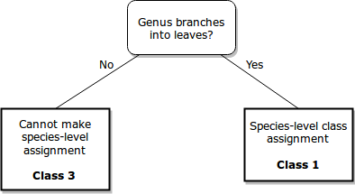

```{r setup, include=FALSE, echo=FALSE}
knitr::opts_chunk$set(echo = TRUE)

# Load packages
suppressPackageStartupMessages(library("Vennerable"))
library (knitr)
library (ggplot2)
library(MASS)

# Load data 
sapTbl <- read.csv(file = "/media/Wapuilani/evan/Charybdis_Runs/Philippines/clean/SAP_PHILB/features_95.csv", header = TRUE)
fastaLen = 504

#sapTbl <- na.omit (sapTbl)
#sapTbl$SpeciesLevel[is.na(sapTbl$SpeciesLevel)] <- FALSE

# Delete unneeded rows
sapTbl$BranchCount <- NULL # Is not needed since equivalent to 'SpeciesCount'
sapTbl$TreeDepth <- NULL # Completetly dependent on the assignment rank level. Not interesting?
# Type conversions
sapTbl$SpeciesLevel <- as.logical (sapTbl$SpeciesLevel)
sapTbl$HasHomologuesSuspiciousRecords <- as.logical(sapTbl$HasHomologuesSuspiciousRecords)
sapTbl$DatabaseNotExhausted <- as.logical (sapTbl$DatabaseNotExhausted)
```

**Note:**  In this document, the cutoff for finding “suspicious” database records is an identity score of 0.97 since the standard for accepting a species-assignment is 0.97. 

[Statistical Assignment Package (SAP)](https://github.com/kaspermunch/sap) was used for taxonomic assignment of the gut contents of several Gulf of Mexico species. 
These samples were collected by [Jim Simons' lab](http://gomexsi.tamucc.edu/gomexsi-partners/dr-james-simon/) and processed by the [Genomics Core Lab](http://genomics.tamucc.edu/). 


The companion script evaluateSAP/evaluateSAP.py has been used to quantify several attributes related to the SAP results. 
The goal is to analyze this table to learn which assignments are plausible and what factors affect the ability to make a species-level assignment. 

SAP was run with the default parameters. The most important parameters are these:

| Parameter       | Selected | Description                         | 
| --------------- | -------- | ----------------------------------- |
| Assignment | Barcoder | A Bayesian method for taxonomic assignment that used Markov chain monte carlo. |
| Posterior Probability Cutoff | 0.95 | Only report assignments with posterior probability at least 0.95 |

Command used:

      sap --project Simons8 --database /media/Wapuilani/Databases/FILTER_DB/nr_mito.SAP.fix.fasta \
        /media/Wapualani/evan/Charybdis/Simons/combo/out/Simons....fasta

## Manual Inspection

40 of the 263 assignments were manually inspected by navigating the results webpage that SAP generates. 
Each assignment has a best phylogenetic tree with posterior probabiltiies of all the taxonomic ranks in the tree. 
Also included is the set of selected homologues used for sampling trees and their identity scores against the query sequence. 
Each result could be described as being a member of four general scenario classes. 

**4 Classes of results**

1. **Species-level assignment**

        +Eukaryota (superkingdom) 100%
          +Metazoa (kingdom) 100%
              +Chordata (phylum) 100%
                  +Craniata (subphylum) 100%
                      +Actinopterygii (superclass) 100%
                          +Actinopteri (class) 100%
                              +Neopterygii (subclass) 100%
                                  +Teleostei (infraclass) 100%
                                      +Opistognathidae (family) 100%
                                          +Lonchopisthus (genus) 100%
                                              +Lonchopisthus micrognathus (species) 100%
    
  This is the ideal case, where the sequence is assigned to a particular species.
  The posterior probaility is greater than the cutoff. 
  In order to determine if these assignments are reasonable, they can be compared to the assignments made by other methods
  as well as by checking if the known predator species were assigned. 

2. **Higher-level assignment where tree includes suspicious records**

        +Eukaryota (superkingdom) 100%
          +Metazoa (kingdom) 100%
              +Mollusca (phylum) 100%
                  +Cephalopoda (class) 100%
                      +Coleoidea (subclass) 100%
                          +Neocoleoidea (infraclass) 100%
                              +Decapodiformes (superorder) 100%
                                  +Teuthida (order) 100%
                                      +Oegopsina (suborder) 68%
                                      |   +Enoploteuthidae (family) 14%
                                      |   |   +Abralia (genus) 14%
                                      |   |       +Abralia andamanica (species) 14%
                                      |   +Ommastrephidae (family) 54%
                                      |       +Sthenoteuthis (genus) 13%
                                      |       |   +Sthenoteuthis oualaniensis (species) 13%
                                      |       +Illex (genus) 30%
                                      |           +Illex cf. oxygonius DBC-2006 (species) 8%
                                      |           +Illex cf. coindetii DBC-2006 (species) 7%
                                      +Myopsina (suborder) 32%
                                          +Loliginidae (family) 32%
                                              +Doryteuthis (genus) 32%
                                                  +Doryteuthis pealeii (species) 8%
                                                  +Doryteuthis opalescens (species) 11%
                                                  
  A suspicious record is one that appears to be incorrectly labelled in the reference database. 
  In cases such as the above where the species in the tree are from different genus, 
  they were each run with Blast to find similar sequences. 
  In this example, some species were the only of that genus in the Blast hits whose identity score
  was at least 0.9. This suggested that the database entry is most likely an incorrect identification of the sequence. 
  SAP purposely creates the set of homologues from broad species rather than multiple of the same species;
  any incorrectly labelled sequences are able to strongly hinder the assignment as shown. 
  
3. **Higher-level assignment where the decision was legitimately difficult to make**
  
        +Eukaryota (superkingdom) 100%
          +Fungi (kingdom) 100%
              +Dikarya (subkingdom) 100%
                  +Ascomycota (phylum) 100%
                      +Pezizomycotina (subphylum) 100%
                          +Sordariomycetes (class) 100%
                              +Hypocreomycetidae (subclass) 100%
                                  +Hypocreales (order) 100%
                                      +Nectriaceae (family) 100%
                                          +Fusarium (genus) 100%
                                              +Fusarium babinda (species) 9%
                                              +Fusarium sacchari (species) ~0%
                                              +Fusarium circinatum (species) 15%
                                              +Fusarium incarnatum (species) 12%
                                              +Fusarium diversisporum (species) 11%
                                              +Fusarium equiseti (species) 9%
                                              
  In this case, there is very high posterior probability at the genus level, but unable to make an
  assignment at the species level. The species sequences were Blasted, but all appear to be correctly labelled.
  The issue is that they are all very similar to each other at the genetic region (in this case the COI of mtDNA), 
  and it is not clear which should be chosen for assignment. So the software steps back and and offers the genus-level for assignment. 
  This may be considered an advantage over Blast which is typically used by selecting the top hit. 
  The top hit may be a naive choice, especially when multiple hits have the same indenty score. 
                                              
4. **Database not exhausted**

        +Eukaryota (superkingdom) 100%
            +Metazoa (kingdom) 100%
                +Chordata (phylum) 100%
                    +Craniata (subphylum) 38%
                        +Actinopterygii (superclass) 8%
                            +Actinopteri (class) 8%
                                +Neopterygii (subclass) 8%
                                    +Teleostei (infraclass) 8%
                                        +Atherinomorphae (superorder) 7%
                                            +Beloniformes (order) 7%
                                                +Belonoidei (suborder) 7%
                                                    +Exocoetidae (family) 7%
                                                        +Cheilopogon (genus) 2%
                                                        +Exocoetus (genus) 4%
                                                            +Exocoetus monocirrhus (species) 4%
                                                            
  The warning that the "database was not exhausted" occurs when every homologue is part of a defining clade at least once during the sampling.
  This is a problem because it means that one cannot be sure if an additional homologue would also be a member of a clade.
  Therefore, the choice of cutting off at fifty homologues might be innapropriate.
  In practice, whenever that warning was observed the tree had very little branching but had low probabilities for all but the very largest ranks. 
  In this examplem, it drops from 1.0 to 0.39 at the subphylum level. It appears that the existance of many homologues that end up being members of 
  sampling trees (and thus having some proportion of the trees) corrosponds to lowering the probabilities for all homologues. 
  Is this because the query sequence is ambiguous/noisy and has portions that align with very unrelated species?
  Or are database errors once again causing unrelated species to appear related and tarnishing the results, just at higher taxonomic rank?
  
  
5. **Just below the cutoff**
                                  
A fifth class was not observed, but is expected to exist. This is the case where a species-level assignment was not made, but only because it fell just short of the 0.95 posterior probability threshold. A question posed by this research is if a less strict threshold would allow more legitimate species-leve assignments. 

## Evaluation Data Collected

**ID** (string)

ID of the OTU sequence. Only those sequences that were assigned to some taxonomic rank included. 
Of interest is what factors lead to a higher taxonomic ranking than species being chosen. 
The assumption is that those unable to be assigned at all are legitimately difficult to assign and may be noisy sequences or unrepresented species. 

**has species level** (boolean)

Whether or not the OTU was assigned at the species level. If False, the assignment was at a higher rank such as genus or phylum.


**species count** (integer)

Number of species (homologous sequences) included in the best phylogenetic tree.
This is equivalent to the number of tree branches. 

**branch leaf count** (integer)

The number of times that a genus branches, resulting in leaves that come from the same node. 
It is expected that homologues would be in the same genus. 
The case where multiple high probable sequences from the same genus occur could represent an instance where it was legitimatly difficult to choose the correct species.

**interior leaf count** (integer)

The number of times that branches occur at interior nodes, such as at the phylum or family ranks. 
This means that significant homologue sequences occur in different genus.
Since genetic regions should differ more among sequences of different branches in the phylogenetic tree, this may be
indicative of mislabelled sequences in the reference database. 

**species probability max** (decimal)

The highest posterior probability for a species.
The default SAP threshold for a species-level assignment is 0.97.

**species probability min** (decimal)

The lowest posterior probability for a species.


**homologues to analyze count** (integer)

A homologue is analyzed for the evaluation when it has an identity score >= 0.90 with the query sequences.
Analyses means to see if the homologue appears to be mislabelled in the reference database.

**homologues suspicious records count** (integer)

The number of analyzed homologues whose genus differed from the most frequent genus in that homologues blast results. 
Only those results whose identity with the blasted homologue was >= 0.90 are included. 

**has homologues suspicious records** (boolean)

Whether or not suspicious records exist. This is true when "homologues suspicious records count" > 0. 


## Data overview
```{r overview, fig.width=10,fig.height=5, echo = FALSE}
sapTbl <- na.omit (sapTbl)
# Display first 10 rows (the 'head') as example
sapTblHead <- head(sapTbl)
kable (sapTblHead)

# Summarize data set
summary(sapTbl[2:ncol(sapTbl),])
```

### Species Assignment
```{r speciesAssignment, fig.width=10,fig.height=5, echo = FALSE}
sapTbl <- na.omit (sapTbl)
numSpeciesLevel = nrow (sapTbl[sapTbl$SpeciesLevel  == TRUE, ])
numHigherLevel = nrow (sapTbl[sapTbl$SpeciesLevel  == FALSE, ])
numUnassigned = fastaLen - (numSpeciesLevel + numHigherLevel)
slices <- c(numSpeciesLevel, numHigherLevel, numUnassigned)
labels <- c("Species-Level", "Nonspecies-Level", "Unassigned")
pie(slices, labels = labels, main="Assignment rank")

```

### Compare posterior probabilties
```{r comparePosteriorProbabilities, fig.width=10,fig.height=5, echo = FALSE}
# Box plots comparing whether or not species rank
VariableNames <- c ("Species Assigned", "Higher Rank Assigned")
# Compare posterior probabilities 
mm_probabilities = melt(sapTbl, id.vars = 'SpeciesLevel', measure.vars = c ('SpeciesProbMax', 'SpeciesProbMin'))
ggplot(mm_probabilities)+geom_boxplot(aes(x=SpeciesLevel, y=value, color=variable))
```

The cutoff would have to lowered to the 0.70-0.75 posterior probability range to see an appreciable increase in the amount of species-level assignments. 
Such a dramatic reduction from the SAP-recommended 0.95 is expected to allow incorrect assignments to be accepted. 
It is notable that the majority of successful assignments had all homologues in tree at a high posterior probability. 
However, even the outliers with near-zero probability did not hinder the ability to make an assignment. 
For the cases where a non-species assignment was made, there is much greater distance between the minimum and maximum probabilities.

### Compare tree topology
```{r compareTreeTopology, fig.width=10,fig.height=5, echo = FALSE}
# Compare tree topology
mm_branches = melt(sapTbl, id.vars = 'SpeciesLevel', measure.vars = c ('BranchLeafCount', 'BranchInteriorCount'))
ggplot(mm_branches)+geom_boxplot(aes(x=SpeciesLevel, y=value, color=variable))
```

Interior node branches in tree topology suggest outliers which affect the sampled trees and thus the propabilities. 
Leaf-level branching (where leaves extend from same parent) indicates the legit cases where the exact species in a genus is unclear.
Based on the manually observed situations, it appears that when a sequence whose lineage branches higher in the tree has very low probability
but affects the probability of the more common group by appearing in a proportion of the sampled trees. 

### Compare homologues
```{r compareHomologues, fig.width=10,fig.height=5, echo = FALSE}
# Compare homologues
mm_homologues = melt(sapTbl, id.vars = 'SpeciesLevel', measure.vars = c ('HomologueCount','HomologuesSuspiciousRecordsCount'))
ggplot(mm_homologues)+geom_boxplot(aes(x=SpeciesLevel, y=value, color=variable))

```

More homologues found in the reference database increases the chance of getting suspicious database records. 
The range of homologue counts differs little between the species-level and higher-level assignments, 
but the mean differs by 25 which is half the maximum. 
Also, the "database not exhausted" scenario seemed to occur when the number of homologues was very large, near 50.

### Database not Exhausted 
```{r databaseNotExhausted, echo = FALSE}
numDBnotExhausted = nrow (sapTbl[sapTbl$DatabaseNotExhausted == TRUE, ]) 
numDBnotExhausted_SpeciesLevel = length (which(sapTbl[sapTbl$DatabaseNotExhausted == TRUE, ]$SpeciesLevel == TRUE))
numDBnotExhausted_HigherLevel = length (which(sapTbl[sapTbl$DatabaseNotExhausted == TRUE, ]$SpeciesLevel == FALSE))
slices <- c(numDBnotExhausted_SpeciesLevel, numDBnotExhausted_HigherLevel)
labels <- c("Species-Level", "Nonspecies-Level")
pie(slices, labels = labels, main="Assignment rank when database not exhausted")

numDBnotExhausted_Suspicious = length(which(sapTbl[sapTbl$DatabaseNotExhausted == TRUE, ]$HasHomologuesSuspiciousRecords == TRUE))
numDBnotExhausted_NotSuspicious = length(which(sapTbl[sapTbl$DatabaseNotExhausted == TRUE, ]$HasHomologuesSuspiciousRecords == FALSE))
slices <- c(numDBnotExhausted_Suspicious, numDBnotExhausted_NotSuspicious )
labels <- c("Suspicious", "Not Suspicious")
pie(slices, labels = labels, main="Whether or not suspicious homologues\n are present when database is not exhausted\n(But assignment at some rank made)")

```

If that database is not exhasuted, it is almost certainly not going to make a species-level identification.
However, the database might not be exhausted even when the reference database appears to be correct. 
It remains to be understood why seemingly legitimate homologues are compiled from widely unrelated species.

## Data Mining

### Classification (J48)

By manually observing trees and analysing the box plots,
it was possible to see that certain factors were indicative of the inability to make a species-level assignment.

Classification mining was performed to create a decision tree that could predict the outcome (whether or not a species-level assignment would be made)
based on data set atributes. Given the table described above, a tree was produced that used exactly the four attributes that were observed to be descrimining factors to build the tree.

The decision tree outcomes have been labelled with the manuall-observed classes that correspond to the decision attribute.
However, we have seen that these attributes are not mutually exclusive. For example, I labelled the case where suspicious homologues exist as Class 2, even though those results could also have been cases of class 4, where the database was not exhausted.




**Tree Accuracy**

__Stratified cross-validation__

- Correctly Classified Instances: 210 (79.8479%)
- Incorrectly Classified Instances: 53 (20.1521%)
- Kappa statistic: 0.6023
- Mean absolute error: 0.2982
- Root mean squared error: 0.3889 
- Relative absolute error: 60.8359%
- Root relative squared error: 78.5655%
- Total Number of Instances: 263     

__Detailed Accuracy By Class__

| TP Rate | FP Rate | Precision | Recall | F-Measure | ROC Area | Class |
| ------- | ------- | --------- | ------ | --------- | -------- | ----- |
| 0.903 | 0.280 | 0.708 | 0.903 | 0.794 | 0.807 | True |
| 0.720 | 0.097 | 0.908 | 0.720 | 0.803 | 0.807 | False |


__Confusion Matrix__

| a | b | |
| - | - | - |
| 102 | 11 | a = True |
| 42 | 108 | b = False |

### Conclusions

- An error-free database would prevent the case of mislabelled records preventing a species-level assignment. 
- Where BLAST simply report hits and users are left either accepting the top hit or devising a way to choose one, SAP decides when the species cannot be reliably determined and chooses a higher level where it is sufficiently confident.
- The wealth of data stored by SAP makes it possible to understand how assignments were made. Even when a higher-than-species rank is chosen, can still get statistics on the considered species. This is much easier to evaluate than Ecotag where it was difficult to know why it reported so many high-level ranks. 
- SAP does not want to be biased toward a particular overrepresented species in a database, so it prioritizes broad species selection for homologues. This makes SAP particularly susceptable to outlier sequences.
- The credability of these sequences is not addressed in this document. A companion document compares the SAP results to those from other taxonomic assignment methods as well as to a set of known species that should appear in the results. 
- At a 0.97 Blast identity score for considering suspicious homologues, fewer suspicious homologues were found. While 32 cases of single-suspicious and 18 two-suspicious homologues for an OTU were still present, the use of the suspicious homologues occurance disappeared from the decision tree. That said, the tree was ~ 3% less accurate than when using a 0.90 cutoff. It seems that the existance of species of other genus in the homologues can keep SAP from a species-level assignment even though it is biologically reasonable for species of different genus to have a 0.90 similarity. 


